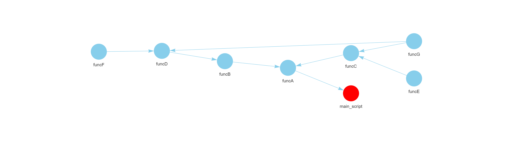

# funcMapper

[](https://CRAN.R-project.org/package=funcMapper)
[](https://github.com/antoniof1704/funcMapper/actions/workflows/R-CMD-check.yaml)
[](https://cran.r-project.org/package=funcMapper)
[](LICENSE)

## Overview
funcMapper is an R package designed to visualise all user-defined functions in a given R script, along with any other user-defined functions they depend on. This tool helps users understand how functions are interconnected within a codebase.

It is especially useful for:
 - Developers new to a codebase who want to quickly understand how functions are used.
 - Teams working collaboratively, to track how newly added functions are being utilised.
 - Developers handing over a project, to provide a clear overview of function dependencies.

## Installation

Install the latest version of funcMapper from CRAN with:

``` r
install.packages("funcMapper")
```

## How to Use funcMapper 

**funcMapper(script_path, output_name, output_path, source = FALSE, cleanup_temp_file = TRUE)**

Arguments:

*script_path*: File path of the R script to analyse (must end with.R).

*output_name*: Name of the output HTML file (no need to include .html).

*output_path*: Directory where the HTML file will be saved (do not include a trailing /).

*source*: Whether to run the script to load functions into the global environment (default is FALSE; set to TRUE if needed).

*cleanup_temp_file*: Whether to delete the temporary script file used during mapping (default is TRUE; set to FALSE to retain it).

The function generates an interactive HTML file containing the function map, saved to the specified output_path.

## Example Output

Below is an example of the output generated by funcMapper. The map is saved as an HTML file and can be viewed in any browser.

<p align="left">


In this example, the script ‘main_script.R’ is used as the entry point and is highlighted in red. The map shows how user-defined functions are interconnected. For instance, the function *funcG* is called by both *funcC* and *funcD*.

Note: You can run funcMapper on any script, not just the main script of a project. However, the script will be wrapped in a function during processing. If the script is already a function, it will be wrapped again.

## More Information 

* funcMapper is available on [CRAN](https://cran.r-project.org/web/packages/funcMapper/index.html)

* An introduction to funcMapper is available in the [vignette](https://cran.r-project.org/web/packages/funcMapper/vignettes/funcMapper-guidance.html)

* Please report bugs or other issues [here](https://github.com/antoniof1704/funcMapper/issues).
