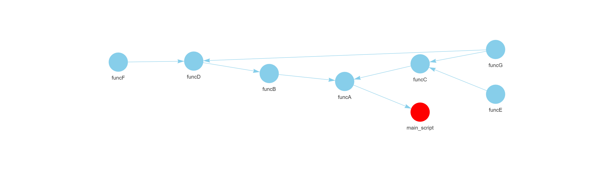

```{r, include = FALSE}
knitr::opts_chunk$set(
  collapse = TRUE,
  comment = "#>"
)
```

# funcMapper: Visualise Function Dependencies in R Scripts

**funcMapper** is an R package designed to visualise all user-defined functions in a given R script, along with any other user-defined functions they depend on. This tool helps users understand how functions are interconnected within a codebase.

It is especially useful for:

- Developers new to a codebase who want to quickly understand how functions are used.
- Teams working collaboratively, to track how newly added functions are being utilised.
- Developers handing over a project, to provide a clear overview of function dependencies.

---

## How to Use `funcMapper`

```r
**funcMapper**(script_path, output_name, output_path, source = FALSE,
cleanup_temp_file = TRUE)
```

### Arguments:

- **`script_path`**: File path of the R script to analyse (must end with `.R`).
- **`output_name`**: Name of the output HTML file (without `.html`).
- **`output_path`**: Directory where the HTML file will be saved.
- **`func_name`**: Optional. Name of the root function to analyse. If not provided, inferred from the script name.
- **`source`**: Whether to source the script into an isolated environment (default `TRUE`).

The function generates an interactive HTML file containing the function map, saved to the specified `output_path`.

---

## Example Output

```{r out.width="100%", echo=FALSE}

```

In this example, the root function (`main`) is highlighted in red. The map shows how user-defined functions are interconnected. For instance, the function `funcG` is called by both `funcC` and `funcD`.

---

## How `funcMapper` Works

`funcMapper` creates an interactive function map by analysing a specified R script. It uses `find_dependencies()` from the **functiondepends** package to recursively trace all user-defined function dependencies.

The process involves:

1. Sourcing the specified script into a private environment.
2. Identifying and highlighting the root function in the map.
3. Recursively mapping all nested user-defined functions.
4. Generating an interactive **visNetwork** visualisation that shows the structure and relationships between functions.

The root function node is highlighted in red for easy identification.

---

## Notes

- You can run funcMapper on any R script. 
- If the script does not define a function matching its filename, you can specify the root function using func_name.
- The output HTML file is self-contained and can be opened in any browser.
